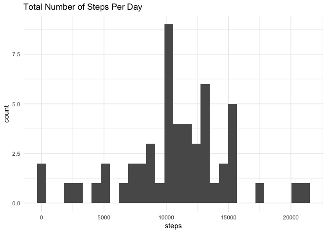
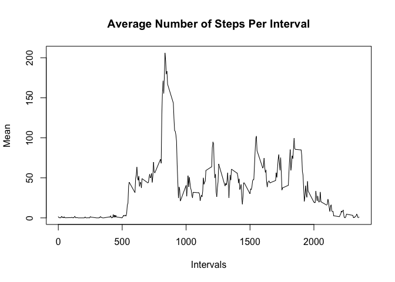
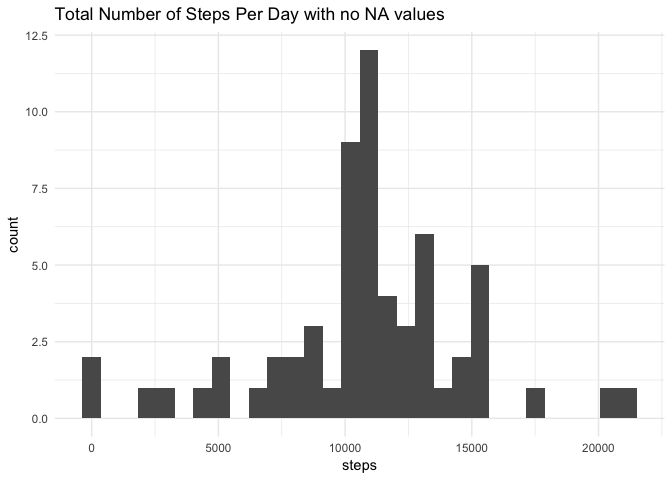
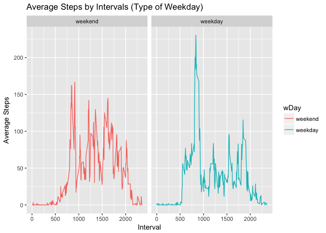

## Loading and preprocessing the data


```r
library(ggplot2)
activityData <- read.csv("activity.csv")
```

## What is mean total number of steps taken per day?

##### 1. Calculate the total number of steps taken per day

```r
stepsYear <- aggregate(steps ~ date, activityData, sum)
```

##### 2. Make a histogram of the total number of steps taken per day

```r
ggplot(stepsYear, aes(x = steps)) +
  geom_histogram() +
  labs(title = "Total Number of Steps Per Day") +
  theme_minimal()
```

```
## `stat_bin()` using `bins = 30`. Pick better value with `binwidth`.
```

<!-- -->

##### 3. Calculate and report the mean and median of the total number of steps taken per day.

```r
mean(stepsYear$steps)
```

```
## [1] 10766.19
```

```r
median(stepsYear$steps)
```

```
## [1] 10765
```

## What is the average daily activity pattern?

##### 1. Make a time series plot (i.e. type="l") of the 5-minute interval (x-axis) and the average number of steps taken, averaged across all days (y-axis)


```r
intervalMean <- aggregate(activityData$steps, by=list(activityData$interval), FUN = mean, na.rm=TRUE)
names(intervalMean) <- c("interval", "mean")

plot(intervalMean$interval, intervalMean$mean, type = "l",
     xlab = "Intervals", ylab = "Mean", main = "Average Number of Steps Per Interval")
```

<!-- -->

##### 2. Which 5-minute interval, on average across all the days in the dataset, contains the maximum number of steps?


```r
intervalMean[which.max(intervalMean$mean), ]$interval
```

```
## [1] 835
```

## Imputing missing values

##### 1. Calculate and report the total number of missing values in the dataset (i.e. the total number of rows with NAs)


```r
sum(is.na(activityData$steps))
```

```
## [1] 2304
```

##### 2. Devise a strategy for filling in all of the missing values in the dataset.


```r
# Creating dataframe to fill NA values
filledNAData <- activityData

# logical vector containing just the rows with NA values
naData <- is.na(filledNAData$steps)

# dataframe containing no NA values
missingNAData <- activityData[!is.na(activityData$steps), ]

# Vector of the interval mean data
intervalAvg <- tapply(missingNAData$steps, missingNAData$interval, mean, na.rm=TRUE, simplify=T)
```

##### 3. Create a new dataset that is equal to the original dataset but with the missing data filled in.


```r
# fill the dataframe with interval data for the NA values
filledNAData$steps[naData] <- intervalAvg[as.character(filledNAData$interval[naData])]
```

##### 4. Make a histogram of the total number of steps taken each day and Calculate and report the mean and median total number of steps taken per day. Do these values differ from the estimates from the first part of the assignment? What is the impact of imputing missing data on the estimates of the total daily number of steps?

>The only values that differ from the first part of the assignment is the median. The median of the data that contains the NA values differs from 1.19.
>The impact of inputing the missing data made the median equal to the mean.


```r
# dataframe containing sum of the steps per day with NA values filled
stepsYearFilled <- aggregate(steps ~ date, filledNAData, sum)

# plotting of the dataframe
ggplot(stepsYearFilled, aes(x = steps)) +
  geom_histogram() +
  labs(title = "Total Number of Steps Per Day with no NA values") +
  theme_minimal()
```

```
## `stat_bin()` using `bins = 30`. Pick better value with `binwidth`.
```

<!-- -->


```r
# mean total number of steps.
mean(stepsYearFilled$steps)
```

```
## [1] 10766.19
```


```r
# median total number of steps
median(stepsYearFilled$steps)
```

```
## [1] 10766.19
```

## Are there differences in activity patterns between weekdays and weekends?

##### 1. Create a new factor variable in the dataset with two levels – “weekday” and “weekend” indicating whether a given date is a weekday or weekend day.


```r
# Changed Date variable to Date format
filledNAData$date <- as.Date(filledNAData$date)

# Create weekday variable to hold the days of a weekday
weekday <- c('Monday', 'Tuesday', 'Wednesday', 'Thursday', "Friday")

# Add a column to differeniate the days
filledNAData$wDay <- factor((weekdays(filledNAData$date) %in% weekday),
                            levels = c(FALSE, TRUE), labels = c('weekend', 'weekday'))
```

##### 2. Make a panel plot containing a time series plot (i.e.type = "l") of the 5-minute interval (x-axis) and the average number of steps taken, averaged across all weekday days or weekend days (y-axis).


```r
# Average the number of steps per interval
stepsDay <- aggregate(steps ~ interval + wDay, filledNAData, mean, na.rm = TRUE)

# Plot the data based on weekday
ggplot(stepsDay, aes(x = interval, y = steps, color = wDay)) +
  geom_line() +
  facet_grid(~wDay) +
  labs(title = "Average Steps by Intervals (Type of Weekday)", x = "Interval", y = "Average Steps")
```

<!-- -->
